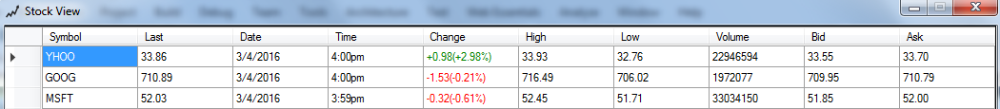

Stock View - Pro Tax group sample app 
=====================================

Welcome to the Pro Tax group sample App.

This sample app is meant to provide working examples of how to pull stock quotes using multithreading with good design:

## Table of Contents

* [Requirements](#requirements)
* [First Use Instructions](#first-use-instructions)
* [Configuration](#configuration)
* [Known Issue](#known-issue)
* [Running the code](#running-the-code)
* [Project Structure](#project-structure)
* [Class Diagram](#class-diagram)
* [Dependency Diagram](#dependency-diagram)
* [Screen Shot](#screenshot-diagram)
* [Contributing to the Repository](#contributing-to-the-repository)
* [Reporting Issues](#reporting-issues)

## Requirements

In order to successfully run this sample app you need a few things:

1. ![Visual Studio 2013] (images/studio.jpg "Visual Studio Version")

 
## First Use Instructions

1. Clone the GitHub repo to your computer
2. Fill in your Configuration file values.

## Configuration

## Known Issue.

1. Timeout of the service is not handled
2. Async of quotes on thread level will be handled in v2

## Running the code

Once the sample app code is on your computer, you can do the following steps to run the app:

1. Ctrl + Shift + B to build the solution</li>
2. F5 to Run the solution</li>

## Project Structure

## Class Diagram

## Dependency Diagram

## Screen Shot 

## Feedback

Your feed back is appreciated and it will motivate us to improve the app. Please send your valuable feedback to sumod_madhavan@intuit.com. I will try my best to incorporate the valid requests.

## Release

 V1.0 

## Upcoming Release

 V2.0 
 
 V3.0
 
 
## Contributing to the Repository ###

If you find any issues or opportunities for improving this respository, fix them!  Feel free to contribute to this project by [forking](http://help.github.com/fork-a-repo/) this repository and make changes to the content.  Once you've made your changes, share them back with the community by sending a pull request. Please see [How to send pull requests](http://help.github.com/send-pull-requests/) for more information about contributing to Github projects. Please help in writing test cases to the Test Project.

## Reporting Issues ###

If you find any issues with this demo that you can't fix, feel free to report them in the [issues](https://github.com/IntuitDeveloper/SampleApp-TimeTracking_Invoicing-DotNet/issues) section of this repository.

